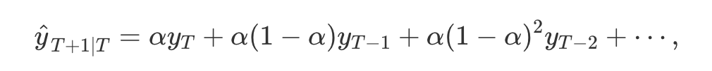

# MSE

$$
\Large \frac{1}{n} \sum\limits_{t=1}^{n} \left(Y_{t} - \hat{Y}_{t} \right)^2
$$

# Passeio Aleatório
$$
\Large \hat{Y}_{t}=Y_{t-1}
$$

# Passeio Aleatório Sazonal
$$
\Large \hat{Y}_{t}=Y_{t-12}
$$

# Suavização Exponencial

$$
\Large \hat{Y}_{t} = \alpha Y_{t-1} + (1 - \alpha) \hat{Y}_{t-1} 
$$

$$
\Large \hat{Y}_{t-1} = \alpha Y_{t-2} + (1 - \alpha) \hat{Y}_{t-2} 
$$

$$
\Large \hat{Y}_{t} = \alpha Y_{t-1} + (1 - \alpha)(\alpha Y_{t-2} + (1 - \alpha) \hat{Y}_{t-2})=\alpha Y_{t-1} + (1 - \alpha) \alpha Y_{t-2} + (1 - \alpha)^2 \hat{Y}_{t-2} 
$$

$$
\Large \hat{Y}_{t} = \alpha Y_{t-1} + (1 - \alpha) \alpha Y_{t-2} + (1 - \alpha)^2 \alpha Y_{t-3} + (1 - \alpha)^3 \alpha Y_{t-4} + \ldots
$$

Alternative [here](https://otexts.com/fpp2/ses.html)

Outra forma de escrever a fórmula de alisamento exponencial.
$$
\Large S_{t} = \alpha Y_{t} + (1 - \alpha) S_{t-1} 
$$
$$
\Large F_{t+1} = S_{t} 
$$

# Alisamento Exponencial de Holt (Duplo)
$$
\Large S_{t} = \alpha Y_{t} + (1 - \alpha) (S_{t-1} + T_{t-1})
$$
$$
\Large T_{t} = \beta (S_t - S_{t-1}) + (1 - \beta)T_{t-1}
$$
$$
\Large F_{t+1} = S_t + T_t
$$

# Decomposição Aditiva

$$
\Large y_{t} = T_{t} + S_{t} + R_{t}
$$

# Decomposição Multiplicativa

$$
\Large y_{t} = T_{t} \times S_{t}  \times  R_{t}
$$

# ADF test
$$
\Large  \Delta Y_t = \gamma Y_{t-1} + \epsilon_t
$$